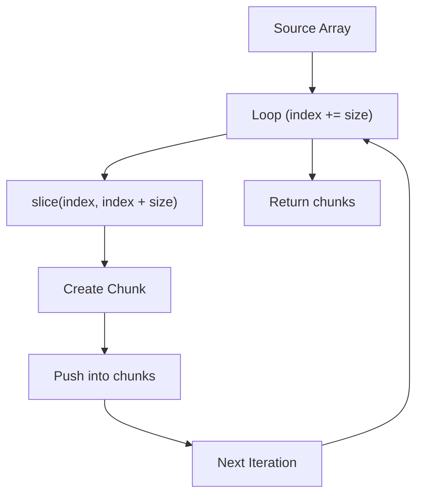

# 000 - Chunk Array Utility

## Overview

The `chunkArray()` utility function exists to solve a UI problem rather than a data storage problem.

In the Hero Carousel feature, menu data is received as a one-dimensional array:

```ts
[menu1, menu2, menu3, menu4, menu5, menu6, menu7, menu8, menu9, menu10];
```

However, the Hero Carousel displays data in groups (slides), not as one large collection.

Desired structure:

```ts
[
  [menu1, menu2, menu3, menu4],
  [menu5, menu6, menu7, menu8],
  [menu9, menu10],
];
```

The responsibility of `chunkArray()` is transforming a one-dimensional array into a two-dimensional array that matches how the carousel operates.

---

## Visual Flow



---

## Source Code

```ts
export function chunkArray<T>(array: T[], size: number): T[][] {
  const chunks: T[][] = [];

  for (let index = 0; index < array.length; index += size) {
    chunks.push(array.slice(index, index + size));
  }

  return chunks;
}
```

---

## Generic Type

`<T>` is a Generic Type.

Instead of limiting the utility to `Menu[]`, the function can work with any array type such as:

```ts
chunkArray<number>(numbers, 4);
chunkArray<string>(names, 4);
chunkArray<Menu>(menus, 4);
chunkArray<User>(users, 4);
```

The utility does not care about the shape of the data. It only reorganizes array positions into groups.

---

## Parameters

### array: T[]

The source data that will be transformed.

### size: number

Determines how many items should exist inside each chunk.

Example:

```ts
size = 4;
```

Result:

```ts
[
  [1, 2, 3, 4],
  [5, 6, 7, 8],
  [9, 10],
];
```

---

## Return Type

```ts
T[][]
```

The function transforms:

```ts
T[]
```

into:

```ts
T[][]
```

The outer array represents slides.

The inner arrays represent items inside each slide.

---

## Step 1 - Create Result Container

```ts
const chunks: T[][] = [];
```

This variable stores every generated chunk.

Initially:

```txt
[]
```

After processing:

```ts
[
  [1, 2, 3, 4],
  [5, 6, 7, 8],
  [9, 10],
];
```

---

## Step 2 - Start the Loop

```ts
for (
  let index = 0;
  index < array.length;
  index += size
)
```

The loop moves through the source array and determines where each chunk begins.

---

## Step 3 - Why index += size?

Instead of:

```ts
index++;
```

the function uses:

```ts
index += size;
```

If:

```ts
size = 4;
```

the loop becomes:

```txt
index = 0
index = 4
index = 8
```

Each iteration represents the beginning of a new chunk.

---

## Step 4 - Extract Data Using slice()

```ts
array.slice(index, index + size);
```

Examples:

```ts
array.slice(0, 4);
```

Result:

```ts
[1, 2, 3, 4];
```

```ts
array.slice(4, 8);
```

Result:

```ts
[5, 6, 7, 8];
```

```ts
array.slice(8, 12);
```

Result:

```ts
[9, 10];
```

---

## Step 5 - Store the Chunk

```ts
chunks.push(array.slice(index, index + size));
```

Progression:

```ts
[];
```

↓

```ts
[[1, 2, 3, 4]];
```

↓

```ts
[
  [1, 2, 3, 4],
  [5, 6, 7, 8],
];
```

↓

```ts
[
  [1, 2, 3, 4],
  [5, 6, 7, 8],
  [9, 10],
];
```

---

## Step 6 - Return the Final Result

```ts
return chunks;
```

The component receives a fully transformed two-dimensional array ready to be used by the Hero Carousel.

---

## Hero Carousel Integration

```ts
const slides = chunkArray(recommendMenus, ITEMS_PER_SLIDE);
```

Input:

```ts
[menu1, menu2, menu3, menu4, menu5, menu6, menu7, menu8, menu9, menu10];
```

Output:

```ts
[
  [menu1, menu2, menu3, menu4],
  [menu5, menu6, menu7, menu8],
  [menu9, menu10],
];
```

Each inner array becomes one carousel slide.

---

## Summary

```txt
T[]
↓
chunkArray()
↓
T[][]
↓
slides
↓
HeroCarousel
↓
HeroCardArea
↓
HeroCard
```
