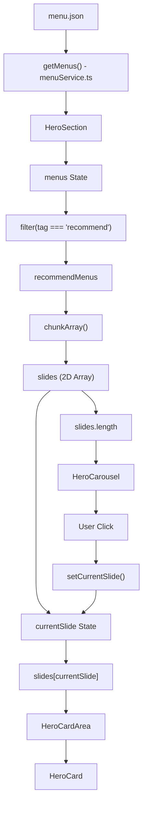

# 001 - Hero Carousel Architecture

## Architecture Overview

This document explains the complete data flow of the Hero Carousel feature, starting from the mock database (`menu.json`) until menu cards are rendered on screen and updated through carousel navigation.

---

## Full Data Flow



---

# Step 1 - Data Source

## menu.json

The application stores menu information inside `menu.json`.

Each menu item contains:

```ts
{
  id: number;
  name: string;
  price: number;
  category: string;
  description: string;
  tag: string;
  stars: number;
}
```

Example:

```json
{
  "id": 1,
  "name": "Greek Salad",
  "tag": "recommend"
}
```

This file acts as a temporary mock database.

---

# Step 2 - Service Layer

## menuService.ts

The service layer is responsible for retrieving menu data.

```ts
export async function getMenus(): Promise<Menu[]> {
  return new Promise((resolve) => {
    setTimeout(() => {
      resolve(menus as Menu[]);
    }, 500);
  });
}
```

### Responsibilities

- Import menu data from `menu.json`
- Simulate API latency using `setTimeout`
- Return a Promise
- Provide menu data to components

---

# Step 3 - Loading Data

## HeroSection

When HeroSection mounts:

```tsx
useEffect(() => {
  async function loadMenus() {
    const data = await getMenus();
    setMenus(data);
  }

  loadMenus();
}, []);
```

### Flow

```txt
HeroSection Mounted
        ↓
getMenus()
        ↓
await data
        ↓
setMenus(data)
        ↓
React Re-render
```

After this process:

```ts
menus: Menu[]
```

contains all menu items.

---

# Step 4 - Filter Recommended Menus

Only menus with:

```ts
tag === "recommend";
```

will appear inside the Hero section.

```tsx
const recommendMenus = menus.filter((menu) => menu.tag === "recommend");
```

Result:

```txt
All Menus
    ↓
filter()
    ↓
Recommend Menus
```

---

# Step 5 - Create Carousel Slides

## chunkArray()

The filtered menu data is split into multiple slide groups.

```tsx
const ITEMS_PER_SLIDE = 4;
```

```tsx
const slides = chunkArray(recommendMenus, ITEMS_PER_SLIDE);
```

Example:

```txt
recommendMenus

[1,2,3,4,5,6,7,8,9,10]

↓

slides

[
 [1,2,3,4],
 [5,6,7,8],
 [9,10]
]
```

Result type:

```ts
Menu[][]
```

Each inner array represents one carousel page.

---

# Step 6 - Active Slide State

HeroSection stores:

```tsx
const [currentSlide, setCurrentSlide] = useState(0);
```

Example:

```txt
currentSlide = 0
```

Means:

```ts
slides[0];
```

is displayed.

If:

```txt
currentSlide = 1
```

Then:

```ts
slides[1];
```

is displayed.

---

# Step 7 - Send Data to HeroCardArea

HeroSection passes only the active slide.

```tsx
<HeroCardArea menus={slides[currentSlide] ?? []} />
```

Example:

```txt
slides

[
 [1,2,3,4],
 [5,6,7,8]
]

currentSlide = 0

↓

[1,2,3,4]
```

Only those four menu items are sent.

The fallback:

```tsx
?? []
```

prevents undefined values during the first render.

---

# Step 8 - HeroCardArea

HeroCardArea receives:

```ts
Menu[]
```

through props.

```tsx
type HeroCardAreaProps = {
  menus: Menu[];
};
```

The component loops through every menu item.

```tsx
menus.map((menu) => <HeroCard key={menu.id} menu={menu} />);
```

Flow:

```txt
Menu[]
   ↓
.map()
   ↓
HeroCard
```

---

# Step 9 - HeroCard

HeroCard receives one menu object.

```tsx
type HeroCardProps = {
  menu: Menu;
};
```

Example:

```ts
{
  id: 1,
  name: "Greek Salad",
  price: 80
}
```

HeroCard renders:

- Menu Name
- Description
- Price

```tsx
<h3>{menu.name}</h3>
<p>{menu.description}</p>
<span>${menu.price}</span>
```

---

# Step 10 - HeroCarousel

HeroCarousel receives:

```tsx
<HeroCarousel
  totalSlides={slides.length}
  currentSlide={currentSlide}
  setCurrentSlide={setCurrentSlide}
/>
```

---

## totalSlides

Determines how many buttons should be rendered.

Example:

```txt
slides.length = 3
```

Result:

```txt
[1] [2] [3]
```

---

## currentSlide

Determines which button is active.

```tsx
className={
  currentSlide === index
    ? "active"
    : ""
}
```

---

## setCurrentSlide

Updates slide state.

```tsx
onClick={() =>
  setCurrentSlide(index)
}
```

---

# Step 11 - User Interaction

User clicks:

```txt
Button 2
```

Flow:

```txt
User Click
     ↓
setCurrentSlide(1)
     ↓
State Updated
     ↓
React Re-render
     ↓
slides[1]
     ↓
HeroCardArea
     ↓
HeroCard
```

The displayed menu cards automatically change.

---

# Complete Summary

```txt
menu.json
    ↓
menuService.ts
    ↓
getMenus()
    ↓
menus State
    ↓
filter(tag === "recommend")
    ↓
recommendMenus
    ↓
chunkArray()
    ↓
slides (Menu[][])
    ↓
slides[currentSlide]
    ↓
HeroCardArea
    ↓
HeroCard
```

Carousel update flow:

```txt
HeroCarousel
      ↓
User Click
      ↓
setCurrentSlide()
      ↓
currentSlide State
      ↓
HeroSection Re-render
      ↓
slides[currentSlide]
      ↓
HeroCardArea
      ↓
HeroCard
```
