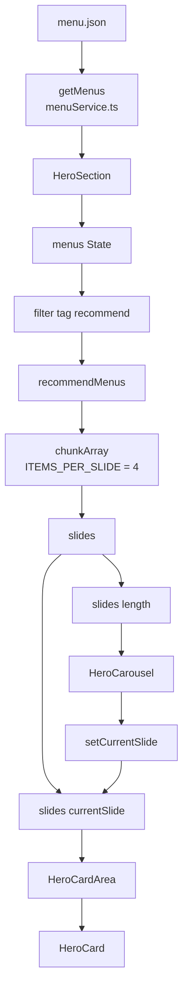

# 001 - Hero Card Data Flow

## Overview

This document explains how menu data flows from the service layer into the Hero section carousel, how the data is grouped into slide blocks, and how the active slide is rendered dynamically.

---

## Data Flow Diagram



---

## HeroSection

### 1. Load Menu Data

`HeroSection` is responsible for fetching menu data from `menuService.ts`.

The `getMenus()` function is called inside a `useEffect()` hook when the component mounts. Once the promise resolves, the returned data is stored inside the `menus` state using `setMenus()`.

```tsx
useEffect(() => {
  async function loadMenus() {
    const data = await getMenus();
    setMenus(data);
  }

  loadMenus();
}, []);
```

---

### 2. Filter Recommended Menus

After the menu data has been loaded into the `menus` state, the data is filtered to retrieve only items whose `tag` value equals `"recommend"`.

```tsx
const recommendMenus = menus.filter((menu) => menu.tag === "recommend");
```

The filtered result is stored in the `recommendMenus` variable.

---

### 3. Create Slide Blocks

The number of menu cards displayed per carousel slide is controlled by the `ITEMS_PER_SLIDE` constant.

```tsx
const ITEMS_PER_SLIDE = 4;
```

The filtered menu data is then divided into multiple slide blocks using the `chunkArray()` utility function.

```tsx
const slides = chunkArray(recommendMenus, ITEMS_PER_SLIDE);
```

For example:

```txt
recommendMenus = [1,2,3,4,5,6,7,8,9,10]

ITEMS_PER_SLIDE = 4

slides = [
  [1,2,3,4],
  [5,6,7,8],
  [9,10]
]
```

This creates a two-dimensional array (`Menu[][]`) where each inner array represents a single carousel slide.

---

### 4. Render Active Slide

The currently active slide is determined by the `currentSlide` state.

```tsx
<HeroCardArea menus={slides[currentSlide] ?? []} />
```

`slides[currentSlide]` retrieves a single slide block from the `slides` array.

The fallback operator `?? []` is used to prevent `undefined` values during the initial render while the menu data is still loading.

As a result, `HeroCardArea` always receives a valid array and can safely render menu cards without causing runtime errors.

---

## HeroCardArea

`HeroCardArea` receives the currently active slide block through props.

```tsx
<HeroCardArea menus={slides[currentSlide] ?? []} />
```

Because `slides` is a `Menu[][]` structure, accessing `slides[currentSlide]` returns a single `Menu[]` block representing one carousel page.

The component then renders each menu item using `.map()`.

```tsx
menus.map((menu) => <HeroCard key={menu.id} menu={menu} />);
```

Each menu object is passed into a `HeroCard` component.

---

## HeroCard

`HeroCard` is responsible for displaying the individual menu information.

It receives a single `Menu` object through props and renders:

- Menu name
- Menu description
- Menu price

```tsx
<HeroCard menu={menu} />
```

---

## HeroCarousel

`HeroCarousel` receives three props from `HeroSection`.

### totalSlides

```tsx
totalSlides={slides.length}
```

This value allows the carousel to dynamically determine how many navigation buttons should be rendered based on the number of slide blocks generated by `chunkArray()`.

---

### currentSlide

```tsx
currentSlide = { currentSlide };
```

This value tells the carousel which slide is currently active so the active button styling can be applied.

---

### setCurrentSlide

```tsx
setCurrentSlide = { setCurrentSlide };
```

This function allows the carousel buttons to update the `currentSlide` state stored inside `HeroSection`.

When a button is clicked:

1. `setCurrentSlide()` updates the state.
2. React performs a re-render.
3. `slides[currentSlide]` points to a different slide block.
4. `HeroCardArea` receives the new menu group.
5. The displayed menu cards change automatically.

---

## Summary

The overall flow is:

```txt
menu.json
    ↓
getMenus()
    ↓
menus State
    ↓
filter(tag === "recommend")
    ↓
recommendMenus
    ↓
chunkArray()
    ↓
slides (Menu[][])
    ↓
slides[currentSlide]
    ↓
HeroCardArea
    ↓
HeroCard
```

Meanwhile, carousel navigation works as follows:

```txt
HeroCarousel
      ↓
setCurrentSlide()
      ↓
currentSlide State
      ↓
slides[currentSlide]
      ↓
HeroCardArea re-renders
```
